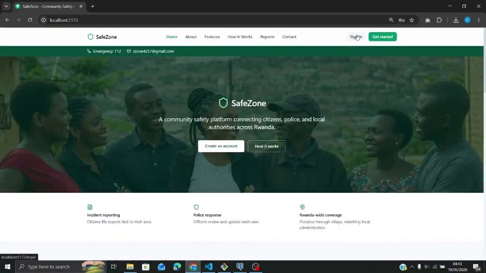
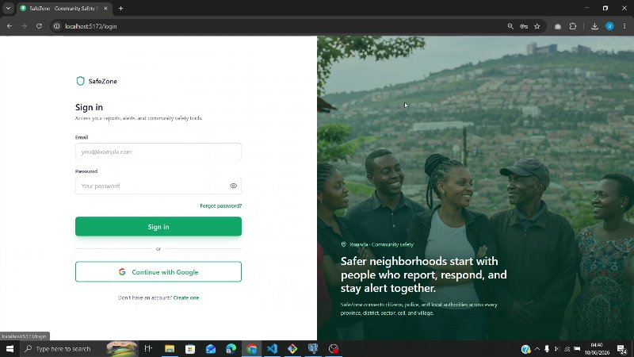
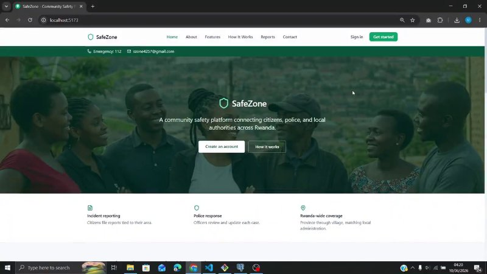

<div align="center">

# SafeZone

**Smart Community Safety & Incident Reporting Platform**

[](https://spring.io/projects/spring-boot)
[](https://react.dev/)
[](https://www.postgresql.org/)
[](https://vite.dev/)

</div>

---

## About

SafeZone is a full-stack community safety platform built to connect **citizens**, **police officers**, and **administrators** around one shared goal — keeping communities informed and able to respond to safety incidents quickly.

The platform allows citizens to report security incidents in their area, police to monitor and respond to those reports, and administrators to manage users, locations, alerts, and system-wide analytics. Every report, alert, and notification is tied to a **specific location**, so safety information reaches the people who need it.

SafeZone is designed around **Rwanda's administrative structure**:

```
Province → District → Sector → Cell → Village
```

This five-level location hierarchy is stored in the backend and used across the entire system. When a citizen submits a report or when police create an alert, the platform uses location data to determine who should be notified and which regional data applies.

On the **frontend**, users interact through role-based dashboards — each role sees only what they need. Citizens manage their own reports and alerts; police handle incident monitoring and alert creation; admins have full control over users, locations, reports, alerts, emergency contacts, and analytics.

On the **backend**, a Spring Boot REST API exposes 56+ endpoints across seven resources — Users, User Profiles, Locations, Reports, Alerts, Notifications, and Emergency Contacts — all persisted in PostgreSQL through JPA/Hibernate.

Together, the frontend and backend form a single **monorepo**, making it easier to develop, maintain, and deploy the full SafeZone system as one project.

## What It Does

- **Incident reporting** — Citizens submit reports with types such as theft, violence, harassment, vandalism, suspicious activity, and emergencies. Each report moves through statuses: `PENDING`, `IN_PROGRESS`, `RESOLVED`, or `CANCELLED`.
- **Safety alerts** — Police and admins create location-based alerts (`WARNING`, `EMERGENCY`, `INFO`, `SAFETY_ALERT`, `COMMUNITY_UPDATE`) that target users in the affected area.
- **Notifications** — Users receive notifications linked to reports and alerts, with read/unread tracking and mark-all-read support.
- **Emergency contacts** — A location-based directory of police, fire, medical, ambulance, and other emergency services.
- **Location management** — Admins build and maintain the full Rwanda administrative hierarchy from province down to village.
- **User management** — Role-based access for **Citizen**, **Police**, and **Admin** users, with profile management for each account.
- **Dashboards & analytics** — Role-specific dashboards with statistics, charts, recent activity, and management tools.

## Demo

Walkthroughs for each user role. **Click a preview to watch the full video.**

### Admin

[](https://github.com/MagnifiqueUwizeye01/Safezone/blob/main/videos/admin-demo.mp4)

### Police

[](https://github.com/MagnifiqueUwizeye01/Safezone/blob/main/videos/police-demo.mp4)

### Citizen

[](https://github.com/MagnifiqueUwizeye01/Safezone/blob/main/videos/citizen-demo.mp4)

## How It Works

SafeZone is a **monorepo** with two applications that work together:

1. **Frontend** (`frontend/`) — A React + Vite application with public pages (Home, About, Features, Contact), authentication pages (Login, Register, Forgot Password, OTP, 2FA), and protected role-based routes for Admin, Police, and Citizen dashboards.
2. **Backend** (`backend/`) — A Spring Boot REST API organized into controllers, services, repositories, models, and enums. It handles all business logic and data persistence.
3. **Database** — PostgreSQL stores seven core entities: `User`, `UserProfile`, `Location`, `Report`, `Alert`, `Notification`, and `EmergencyContact`.

**Typical flow:** A citizen submits a report through the React frontend → Axios sends the request to the Spring Boot API → the service layer validates and saves it to PostgreSQL → notifications can be created for relevant users. Alerts follow the same pattern — created by police or admins and targeted to users based on location.

## Tech Stack

| Layer | Technologies |
|-------|--------------|
| Frontend | React 19, Vite 7, Tailwind CSS, React Router, Axios, Lucide React |
| Backend | Java 17, Spring Boot 3.5.6, Spring Data JPA, Maven |
| Database | PostgreSQL |

## Getting Started

### Prerequisites

Java 17, Node.js 18+, PostgreSQL 13+, and Git.

### 1. Clone the repository

```bash
git clone https://github.com/MagnifiqueUwizeye01/Safezone.git
cd Safezone
```

### 2. Set up the database

```sql
CREATE DATABASE safezone_db;
```

Update credentials in `backend/src/main/resources/application.properties`:

```properties
spring.datasource.url=jdbc:postgresql://localhost:5432/safezone_db
spring.datasource.username=YOUR_USERNAME
spring.datasource.password=YOUR_PASSWORD
```

### 3. Run the backend

```bash
cd backend
./mvnw spring-boot:run        # macOS / Linux
mvnw.cmd spring-boot:run      # Windows
```

API runs at **http://localhost:8080**

### 4. Run the frontend

```bash
cd frontend
npm install
```

Create `frontend/.env`:

```env
VITE_API_BASE_URL=http://localhost:8080
```

```bash
npm run dev
```

App runs at **http://localhost:5173**

## Project Structure

```
Safezone/
├── backend/          # Spring Boot API
│   └── src/main/java/com/magnifique/safezone/
│       ├── controller/
│       ├── service/
│       ├── repository/
│       ├── model/
│       └── enums/
├── frontend/         # React application
│   └── src/
│       ├── pages/        # Admin, Police, Citizen, Public
│       ├── components/
│       ├── api/
│       └── routes/
├── videos/           # Demo walkthrough videos
└── README.md
```

## API Reference

The backend exposes 56+ REST endpoints. For the full list, see [`backend/README.md`](backend/README.md).

**Base URL:** `http://localhost:8080`

## Database Schema

<p align="center">
  
</p>

## Author

**Magnifique Uwizeye**

---

<div align="center">

If you find this project useful, consider giving it a star.

</div>
