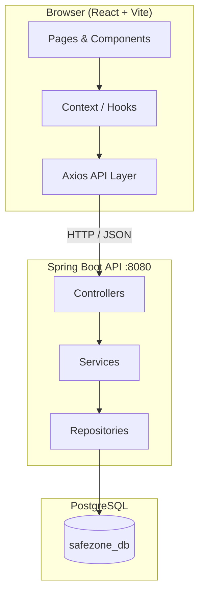

<div align="center">

# SafeZone

**Smart Community Safety & Incident Reporting Platform**

Connect citizens, law enforcement, and administrators through real-time incident reporting, location-based alerts, and community safety tools — built around Rwanda's administrative geography.

<br />

[](https://spring.io/projects/spring-boot)
[](https://react.dev/)
[](https://www.postgresql.org/)
[](https://vite.dev/)
[](https://tailwindcss.com/)

[Features](#-features) · [Architecture](#-architecture) · [Getting Started](#-getting-started) · [API Overview](#-api-overview) · [Project Structure](#-project-structure)

</div>

---

## Overview

**SafeZone** is a full-stack community safety platform that enables:

- **Citizens** to report incidents, view regional alerts, and access emergency contacts
- **Police officers** to monitor reports, create alerts, and track incidents
- **Administrators** to manage users, locations, reports, alerts, and system analytics

Every feature is tied to a **hierarchical location model** reflecting Rwanda's administrative structure:

```
Province → District → Sector → Cell → Village
```

This ensures that reports, alerts, and notifications reach the right people in the right area.

---

## Table of Contents

- [Features](#-features)
- [Architecture](#-architecture)
- [Tech Stack](#-tech-stack)
- [Repository Layout](#-repository-layout)
- [Getting Started](#-getting-started)
  - [Prerequisites](#prerequisites)
  - [Database Setup](#1-database-setup)
  - [Backend Setup](#2-backend-setup)
  - [Frontend Setup](#3-frontend-setup)
  - [Run the Full Stack](#4-run-the-full-stack)
- [User Roles & Access](#-user-roles--access)
- [Database Schema](#-database-schema)
- [API Overview](#-api-overview)
- [Frontend Routes](#-frontend-routes)
- [Project Structure](#-project-structure)
- [Development Workflow](#-development-workflow)
- [Building for Production](#-building-for-production)
- [Environment Variables](#-environment-variables)
- [Troubleshooting](#-troubleshooting)
- [License & Author](#-license--author)

---

## Features

### Core Platform

| Feature | Description |
|---------|-------------|
| **Incident Reporting** | Citizens submit reports with type, status, location, and details |
| **Alert Broadcasting** | Location-aware alerts auto-target users in affected areas |
| **Notifications** | User-specific, read/unread tracked notifications for reports and alerts |
| **Emergency Contacts** | Department-based contacts filtered by location |
| **Location Management** | Full CRUD for Rwanda's 5-level administrative hierarchy |
| **User Profiles** | One-to-one profile extension with avatar URL support |

### Frontend Experience

| Feature | Description |
|---------|-------------|
| **Role-Based Dashboards** | Dedicated views for Admin, Police, and Citizen roles |
| **Protected Routing** | Auth-gated and role-based route access |
| **Global Search** | Search across platform data from the top bar |
| **Two-Factor Auth UI** | OTP verification and 2FA flow (frontend-ready) |
| **Responsive Design** | Mobile-friendly layout with Tailwind CSS |
| **Dark / Light Theme** | Theme context with persistent preference |
| **Pagination & Filtering** | Reusable components across tables and lists |

### Backend Capabilities

| Feature | Description |
|---------|-------------|
| **RESTful API** | 56+ endpoints across 7 resource domains |
| **JPA / Hibernate ORM** | Entity relationships with PostgreSQL persistence |
| **Pagination & Filtering** | Query endpoints with page/size parameters |
| **Auto Schema Sync** | Hibernate `ddl-auto=update` for development |
| **CORS Support** | Cross-origin configuration for frontend integration |

---

## Architecture



### Request Flow

1. User interacts with a React page or component
2. API service calls the Spring Boot REST endpoint via Axios
3. Controller delegates to the service layer for business logic
4. Repository persists or retrieves data from PostgreSQL
5. JSON response is rendered in the UI

### Monorepo Layout

This repository is a **monorepo** — one Git project containing both applications:

```
Safezone/
├── backend/     → Spring Boot REST API
├── frontend/    → React single-page application
└── README.md    → You are here
```

---

## Tech Stack

### Backend (`backend/`)

| Technology | Version | Purpose |
|------------|---------|---------|
| Java | 17 | Runtime |
| Spring Boot | 3.5.6 | Application framework |
| Spring Data JPA | 3.4.1 | ORM & repositories |
| PostgreSQL | 42.4.5 driver | Relational database |
| Maven | Wrapper included | Build & dependency management |

### Frontend (`frontend/`)

| Technology | Version | Purpose |
|------------|---------|---------|
| React | 19 | UI library |
| Vite | 7 | Dev server & bundler |
| Tailwind CSS | 3.4 | Utility-first styling |
| React Router | 6.30 | Client-side routing |
| Axios | 1.13 | HTTP client |
| Lucide React | 0.561 | Icon set |
| date-fns | 4.1 | Date formatting |

---

## Repository Layout

| Path | Description |
|------|-------------|
| [`backend/`](backend/) | Spring Boot API — controllers, services, models, repositories |
| [`frontend/`](frontend/) | React SPA — pages, components, API services, routing |
| [`backend/README.md`](backend/README.md) | Full API endpoint reference |
| [`frontend/README.md`](frontend/README.md) | Frontend-specific setup notes |

---

## Getting Started

### Prerequisites

Make sure the following are installed on your machine:

| Tool | Minimum Version | Verify |
|------|-----------------|--------|
| **Java JDK** | 17 | `java -version` |
| **Node.js** | 18 | `node -version` |
| **npm** | 9+ | `npm -version` |
| **PostgreSQL** | 13+ | `psql --version` |
| **Git** | 2.x | `git --version` |

---

### 1. Database Setup

Create a PostgreSQL database for the application:

```sql
CREATE DATABASE safezone_db;
```

> **Note:** On first run, Hibernate will auto-create tables based on entity models (`spring.jpa.hibernate.ddl-auto=update`).

---

### 2. Backend Setup

```bash
# Clone the monorepo (if you haven't already)
git clone https://github.com/MagnifiqueUwizeye01/Safezone.git
cd Safezone/backend
```

Configure your database credentials in `src/main/resources/application.properties`:

```properties
spring.datasource.url=jdbc:postgresql://localhost:5432/safezone_db
spring.datasource.username=YOUR_DB_USERNAME
spring.datasource.password=YOUR_DB_PASSWORD
```

Start the API server:

```bash
# Windows
mvnw.cmd spring-boot:run

# macOS / Linux
./mvnw spring-boot:run
```

The backend will be available at **`http://localhost:8080`**

---

### 3. Frontend Setup

Open a new terminal:

```bash
cd Safezone/frontend
npm install
```

Create a `.env` file in the `frontend/` directory:

```env
VITE_API_BASE_URL=http://localhost:8080
```

Start the development server:

```bash
npm run dev
```

The frontend will be available at **`http://localhost:5173`**

---

### 4. Run the Full Stack

| Service | URL | Command |
|---------|-----|---------|
| Backend API | `http://localhost:8080` | `./mvnw spring-boot:run` |
| Frontend App | `http://localhost:5173` | `npm run dev` |

Ensure PostgreSQL is running **before** starting the backend.

---

## User Roles & Access

| Role | Backend Enum | Frontend Access |
|------|--------------|-----------------|
| **Citizen** | `CITIZEN` | Submit reports, view alerts, manage profile |
| **Police** | `POLICE` | Manage reports, create alerts, view analytics |
| **Admin** | `ADMIN` | Full system management and analytics |
| **Community Leader** | `COMMUNITY_LEADER` | Backend-supported role |

### Role Capabilities

<details>
<summary><strong>Citizen</strong></summary>

- Dashboard with personal stats
- Create and track incident reports
- View location-based safety alerts
- Browse emergency contacts
- Manage profile and notifications

</details>

<details>
<summary><strong>Police</strong></summary>

- Dashboard with incident overview
- View and manage all reports
- Create and manage regional alerts
- Incident analytics
- Emergency contact directory
- Profile and notifications

</details>

<details>
<summary><strong>Admin</strong></summary>

- System-wide dashboard and analytics
- User management (Citizen, Police, Admin)
- Location hierarchy management
- Report and alert oversight
- Emergency contact administration
- System settings and notifications

</details>

---

## Database Schema

SafeZone uses **7 core entities** with relationships mapped through JPA:

| Entity | Description |
|--------|-------------|
| `Location` | Hierarchical geographic data (Province → Village) |
| `User` | Platform users with role and location assignment |
| `UserProfile` | Extended profile (one-to-one with User) |
| `Report` | Citizen-submitted incident reports |
| `Alert` | Location-based safety alerts |
| `Notification` | User notifications linked to reports/alerts |
| `EmergencyContact` | Department contacts per location |

### ER Diagram

<p align="center">
  
</p>

### Enumerations

| Domain | Values |
|--------|--------|
| **User Roles** | `CITIZEN`, `POLICE`, `ADMIN`, `COMMUNITY_LEADER` |
| **Location Types** | `PROVINCE`, `DISTRICT`, `SECTOR`, `CELL`, `VILLAGE` |
| **Report Types** | `THEFT`, `VIOLENCE`, `HARASSMENT`, `VANDALISM`, `LOST_ITEM`, `SUSPICIOUS_ACTIVITY`, `EMERGENCY`, `OTHER` |
| **Report Status** | `PENDING`, `IN_PROGRESS`, `RESOLVED`, `CANCELLED` |
| **Alert Types** | `WARNING`, `EMERGENCY`, `INFO`, `SAFETY_ALERT`, `COMMUNITY_UPDATE` |

---

## API Overview

**Base URL:** `http://localhost:8080`

| Resource | Base Path | Endpoints | Highlights |
|----------|-----------|-----------|------------|
| Locations | `/location` | 10+ | Hierarchy CRUD, province/child queries |
| Users | `/user` | 10+ | Role filtering, pagination, province queries |
| Reports | `/report` | 8+ | Status filtering, full CRUD |
| Alerts | `/alert` | 8+ | Auto-recipient assignment by location |
| Emergency Contacts | `/emergency-contact` | 12+ | Department & location filtering |
| Notifications | `/notification` | 14+ | Read/unread tracking, mark-all-read |
| User Profiles | `/user-profile` | 7+ | One-to-one user extension |

> For the complete endpoint list with HTTP methods and query parameters, see [`backend/README.md`](backend/README.md).

### Example Requests

**Create a parent location (Province):**
```http
POST /location/parent
Content-Type: application/json

{
  "code": "KGL",
  "name": "Kigali City",
  "type": "PROVINCE"
}
```

**Create an incident report:**
```http
POST /report
Content-Type: application/json

{
  "title": "Suspicious activity reported",
  "description": "Details of the incident...",
  "type": "SUSPICIOUS_ACTIVITY",
  "status": "PENDING"
}
```

**Get paginated reports by status:**
```http
GET /report/status/PENDING/paginated?page=0&size=10
```

---

## Frontend Routes

### Public

| Route | Page |
|-------|------|
| `/` | Home |
| `/about` | About |
| `/features` | Features |
| `/how-it-works` | How It Works |
| `/contact` | Contact |
| `/public-reports` | Public Reports |

### Authentication

| Route | Page |
|-------|------|
| `/login` | Login |
| `/register` | Register |
| `/forgot-password` | Forgot Password |
| `/reset-password` | Reset Password |
| `/verify-otp` | OTP Verification |
| `/two-factor-auth` | Two-Factor Auth |

### Admin (protected)

| Route | Page |
|-------|------|
| `/admin/dashboard` | Dashboard |
| `/admin/users` | User Management |
| `/admin/locations` | Location Management |
| `/admin/reports` | Report Management |
| `/admin/alerts` | Alert Management |
| `/admin/emergency` | Emergency Contacts |
| `/admin/analytics` | Analytics |
| `/admin/notifications` | Notifications |
| `/admin/settings` | System Settings |
| `/admin/profile` | Admin Profile |

### Police (protected)

| Route | Page |
|-------|------|
| `/police/dashboard` | Dashboard |
| `/police/reports` | All Reports |
| `/police/reports/:id` | Report Details |
| `/police/alerts/create` | Create Alert |
| `/police/alerts` | Manage Alerts |
| `/police/analytics` | Incident Analytics |
| `/police/emergency` | Emergency Contacts |
| `/police/notifications` | Notifications |
| `/police/profile` | Police Profile |

### Citizen (protected)

| Route | Page |
|-------|------|
| `/citizen/dashboard` | Dashboard |
| `/citizen/reports/create` | Create Report |
| `/citizen/reports` | My Reports |
| `/citizen/alerts` | View Alerts |
| `/citizen/emergency` | Emergency Contacts |
| `/citizen/notifications` | Notifications |
| `/citizen/profile` | My Profile |

---

## Project Structure

### Backend

```
backend/
├── src/main/java/com/magnifique/safezone/
│   ├── controller/       # REST endpoints
│   ├── service/          # Business logic
│   ├── repository/       # Data access (Spring Data JPA)
│   ├── model/            # JPA entities
│   └── enums/            # Domain enumerations
├── src/main/resources/
│   └── application.properties
├── src/test/java/        # Unit tests
├── pom.xml
└── mvnw / mvnw.cmd
```

### Frontend

```
frontend/
├── src/
│   ├── api/              # Axios config, endpoints, services
│   ├── components/       # Reusable UI (common, layout, feature)
│   ├── context/          # Auth, Theme, Notification, Search
│   ├── hooks/            # useAuth, usePagination, useDebounce
│   ├── pages/            # Route pages (admin, police, citizen, public)
│   ├── routes/           # AppRoutes, ProtectedRoute, RoleBasedRoute
│   ├── utils/            # Helpers, validators, constants
│   └── styles/           # Global CSS
├── public/               # Static assets, favicon
├── index.html
├── vite.config.js
├── tailwind.config.js
└── package.json
```

---

## Development Workflow

```bash
# 1. Pull latest changes
git pull origin main

# 2. Start backend (terminal 1)
cd backend && ./mvnw spring-boot:run

# 3. Start frontend (terminal 2)
cd frontend && npm run dev

# 4. Lint frontend
cd frontend && npm run lint
```

### Recommended Git Workflow

1. Create a feature branch from `main`
2. Make changes in `backend/` and/or `frontend/`
3. Test both services locally
4. Commit with a clear message
5. Open a pull request to `main`

---

## Building for Production

### Backend

```bash
cd backend
./mvnw clean package
java -jar target/safezone-0.0.1-SNAPSHOT.jar
```

### Frontend

```bash
cd frontend
npm run build
npm run preview   # Preview production build locally
```

Production output is written to `frontend/dist/`.

---

## Environment Variables

### Frontend (`frontend/.env`)

| Variable | Default | Description |
|----------|---------|-------------|
| `VITE_API_BASE_URL` | `http://localhost:8080` | Backend API base URL |

### Backend (`backend/src/main/resources/application.properties`)

| Property | Description |
|----------|-------------|
| `spring.datasource.url` | PostgreSQL JDBC connection URL |
| `spring.datasource.username` | Database username |
| `spring.datasource.password` | Database password |
| `spring.jpa.hibernate.ddl-auto` | Schema strategy (`update` for dev) |
| `spring.jpa.show-sql` | Log SQL queries (dev) |

> **Security tip:** Never commit real database passwords. Use environment-specific config or `.env` files excluded via `.gitignore`.

---

## Troubleshooting

| Issue | Solution |
|-------|----------|
| Backend won't start | Verify PostgreSQL is running and credentials in `application.properties` are correct |
| Frontend can't reach API | Confirm `VITE_API_BASE_URL` matches backend URL; ensure backend is on port `8080` |
| CORS errors | Backend allows cross-origin requests in development; restrict origins in production |
| Tables not created | Check `ddl-auto=update` and database connection; review backend console logs |
| `npm install` fails | Ensure Node.js 18+ is installed; delete `node_modules` and retry |
| Port already in use | Stop conflicting processes or change ports in config |

---

## License & Author

**SafeZone** — Smart Community Safety & Incident Reporting Platform

Developed by **Magnifique Uwizeye**

---

<div align="center">

**If this project helps you, consider giving it a star on GitHub.**

[Report Bug](https://github.com/MagnifiqueUwizeye01/Safezone/issues) · [Request Feature](https://github.com/MagnifiqueUwizeye01/Safezone/issues)

</div>
